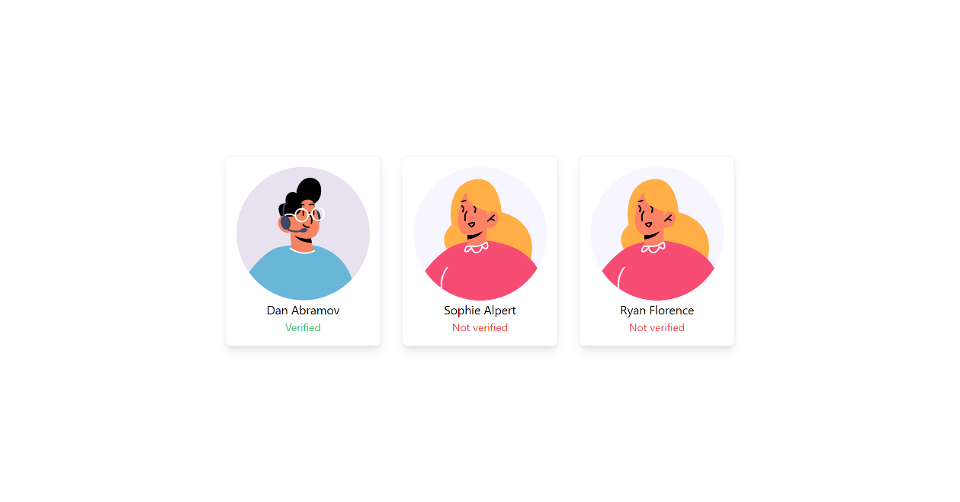
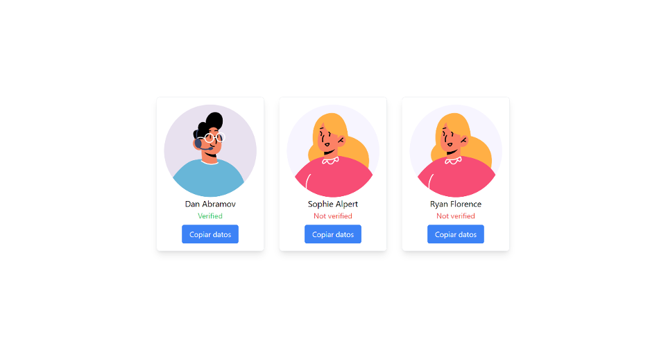

# Módulo 2 - Estilos y Event Handlers en ReactJS

## Librerías de estilos

Existen librerías que nos pueden ayudar simplemente usar su conjunto de reglas precargadas o facilitar la definición de estilos, como es el caso de styled-componentes y Tailwind. Este último es el que usaremos en el curso para aplicar estilos de manera más rápida a nuestros componentes.

## Configurar Tailwind en ReactJS (ViteJS)

Seguiremos los pasos de la [documentación](https://tailwindcss.com/docs/guides/vite) oficial de Tailwind:


Instalar TailwindCSS, PostCSS y Autoprefixer
```bash
npm install -D tailwindcss postcss autoprefixer

npx tailwindcss init -p

```


Crear el archivo `tailwind.config.js` en la raíz del proyecto
```ts
/** @type {import('tailwindcss').Config} */
export default {
  content: [
    "./index.html",
    "./src/**/*.{js,ts,jsx,tsx}",
  ],
  // Usar prefijos en las clases puede ser útil para evitar conflictos con otras librerías o para encontrar más fácilmente las clases de Tailwind
  prefix: 'cd-',
  theme: {
    extend: {},
  },
  plugins: [],
}
```

Editar el archivo `index.css` en la carpeta `src/`
```css
@tailwind base;
@tailwind components;
@tailwind utilities;
```

Para saber cuál es la clase que debemos usar para aplicar un estilo podemos buscarlo en la [documentación](https://tailwindcss.com/docs) de Tailwind 

## Práctica guiada

Para la práctica debemos estilizar nuestro proyecto actual para que luzca lo más similar a lo que tenemos como objetivo. Algunos requisitos son:
- Agrupar a los componentes de manera horizontal.
- Centrarlos de manera tanto vertical como horizontal.
- Añadir un borde y sombra del componente UserProfile.
- En caso de que el usuario esté verificado el texto que lo indica debe ser de color Verde, caso contrario Rojo.
- El texto de cada UserProfile debe estar centrado.

> El código con la solución de la práctica se encuentra en la carpeta `Code/Styles_and_Handlers_end` de este módulo.




## Event Handlers en ReactJS

Los manejadores de eventos en JSX son propiedades que reciben una función. Algunos de estas propiedades pueden enviar parámetros a la función que declaramos, como es el caso de los eventos “onChange”, el cual recibe un evento que contiene el nuevo valor que ha cambiado en el elemento HTML.

## Práctica Event Handlers

Se debe realizar lo siguiente:
- Agregar un botón debajo del componente que tenga como texto `Copiar datos`.
- Al dar clic este debe copiar en el portapapeles los datos del usuario en texto plano y mostrar una alerta en el navegador indicando que los datos han sido copiados exitosamente.

No teman en buscar en internet como acceder o manipular el portapapeles desde el navegador, siempre se debe recurrir a la documentación cuando no se conoce de alguna tecnología o se está aprendiendo de ella.



# Extras

- Leet sobre "Routing Design Patterns" para aplicaciones web.
