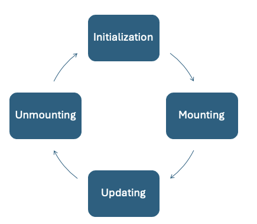

# Módulo 5 - Ciclo de vida de ReactJS

## Ciclo de vida

Este es un concepto ampliamente considerado en diferentes paradigmas y lenguajes de programación. Sobre todo en entornos donde una entidad o instancia contiene estados, los cuales pueden cambiar. Así mismo, temas como la gestión de recursos y su respectiva liberación son cruciales durante su ciclo de vida.

Con los componentes funciones se puede realizar lo mismo. Esto lo logramos con la ayuda de dos principales Hooks “useEffect” y “useLayoutEffect”. Los Hooks de “useMemo” y “useCallback” no están directamente ligados al ciclo de vida del componente, pero si pueden provocar cambios en el ciclo de vida del componente al que esté ligado.



## useEffect vs useLayoutEffect

Previamente mencionamos brevemente que estos dos Hooks tiene un comportamiento muy similar, ambos están involucrados con el render de un componente. Con la diferencia de que “useEffect” tiene su participación después de que el componente haya sufrido algún render y asincronno. Por otro lado,  “useLayoutEffect” sucede antes de algún render y en ASINCRONA.

## Uso de ciclo de vida

Implementaremos nuevos comportamientos en la sección del formulario como:
- useLayout para pre-cargar los datos del user en modo edición. Se realizará un update del state del form.
- useRef, para tomar la referencia a un input y hacer focus en el mismo.
- useEffect, Hacer focus a un componente cuando el componente se muestra.
- useEffect, Limpiar state del form cuando se sale del form (esto será mas útil si tenemos form en modals, normalmente los modals quedan no visibles pero sus states cargados, por lo que es importante reiniciarlos).
- useMemo, para hacer que un componente custom cambie solo cuando verified cambia.

# Memo components

Memoization es un proceso en el que se cachea o “memoriza” un componente. Esto se lo hace principalmente para mejorar el rendimiento de las pagina web. Es importante aislar los componentes y estos se rendericen solo cuando valores asociados a ellos cambien.

## Creación de Hooks

Como muchas veces en programación, para crear algo se parte de bloque fundamentales, entonces para crear un Hook, ¡lo hacemos a través de otros Hooks! La idea o motivación de crear nuestros Hooks es generalmente para encapsular código que debe mantener un estado a través de los renders.

Por ejemplo, podemos necesitar un de Hook de paginación de datos. Con este hooks podemos enviarle todo una Array de datos, un número N que es la cantidad de items por página. Y este nos devuelve una página con N items, una función para ir a la página siguiente, atrás, principio y final.

## Convenciones para Hooks

Las principales convenciones es que el nombre del hook debe iniciar con el prefijo “use” El resto como la firma de la función puede ser a conveniencia del usuario. Ya sea parámetros posicionales o un objecto. El return generalmente es un arreglo y en Typescript debe ser declarado como “as const” para no tener problemas en los tipos. También se puede retornar un objecto para destructuring por nombre y no por posición como hemos visto.

## Creando Hooks de paginación

Estructura de carpetas
```plaintext
src/
  ...
  hooks/
    pagination.ts
  ...
```

Pasos:
1. Crear un archivo llamado `pagination.ts` en la carpeta `hooks`.
2. Crear e hook de paginación, con los siguientes parámetros:
   - `data: T[]`: Array de datos a paginar.
   - `perPage: number`: Cantidad de items por página.
3. El hook debe retornar un arreglo con la siguiente información en este orden:
   1. El número de la página actual.
   2. Los items de la página actual.
   3. El total de páginas.
   4. Una función para ir a la página siguiente.
   5. Una función para ir a la página anterior.
   6. Una función para ir a una página específica (recibe el número de la página).

El contenido del archivo `pagination.ts` debe ser similar al siguiente:
```typescript
import React from 'react';

type PaginationProps<T> = {
  data?: T[];
  pageSize: number;
};

export const usePagination = <T>(params: PaginationProps<T>) => {
  const { data = [], pageSize } = params;

  const [page, setPage] = React.useState(1);

  const [totalPages, setTotalPages] = React.useState(
    Math.ceil(data.length / pageSize)
  );

  React.useEffect(() => {
    setTotalPages(Math.ceil(data.length / pageSize));
  }, [data, pageSize]);

  // Update total pages when data changes
  const pageData = React.useMemo(() => {
    const start = (page - 1) * pageSize;
    const end = start + pageSize;

    return data.slice(start, end);
  }, [data, page, pageSize]);

  return {
    page,
    pageData,
    totalPages,
    totalItems: data.length,
    nextPage,
    prevPage,
    goToPage,
  };

  function nextPage() {
    setPage((prev) => Math.min(prev + 1, totalPages));
  }

  function prevPage() {
    setPage((prev) => Math.max(prev - 1, 1));
  }

  function goToPage(page: number) {
    setPage(Math.min(Math.max(page, 1), totalPages));
  }
};
```

## Extra (revisión en sesión presencial)


### Custom debounce hook
Se realizará la creación de otro hook llamado `useDebounce` que permite retrasar la ejecución de una función hasta que haya pasado un tiempo determinado sin que se haya vuelto a llamar.

Se debe crear un nuevo Hook “useDebounce” el cual recibe como parámetros valor inicial de tipo parametrizado y un valor numérico. Como return devolverá una función para actualizar el valor (como el useState) y el valor almacenado dentro del Hook, pero actualizado solo después de que haya pasado la cantidad de milisegundos especificada en el parámetro numérico.


Es decir, para actualizar el valor dentro del Hook se usará su función retornada pero el valor del state retornado por el Hook solo se actualizará una vez que haya transcurrido la cantidad de milisegundos del parámetro después de la última actualización. Cada vez que se actualiza el valor el contador debe reiniciarse y la actualización solo se efectuará cuando el tiempo necesario se haya cumplido.


Este nuevo Hook sebe ser implementado en la página “/users”. Con el objetivo de agregar un input para buscar un usuario por nombre. Cada vez que el usuario escribe se debe actualiza el valor de Hook, pero la búsqueda vista solo se actualiza cuando el Hook haya retornado el valor actualizado.


Puntos extra: lograr retornar un valor adicional “debouncing” que indica cuando el Hook está esperando que se cumpla el tiempo necesario para actualizar el valor, un análogo de un estado de “cargando”.

### React Hook Form

Esta libreria nos ayudará a manejar formularios de una manera más sencilla y eficiente. Se debe instalar la librería con el siguiente comando:

```bash
npm install react-hook-form @hookform/resolvers
```

Para más información sobre la librería, se puede consultar la documentación oficial en el siguiente enlace: [React Hook Form](https://react-hook-form.com/)

Pasos:
- Refactorizar el formulario del archivo `src/pages/users/form.tsx` para utilizar React Hook Form.
- Remover el uso del hook useState para la variable `state`.
